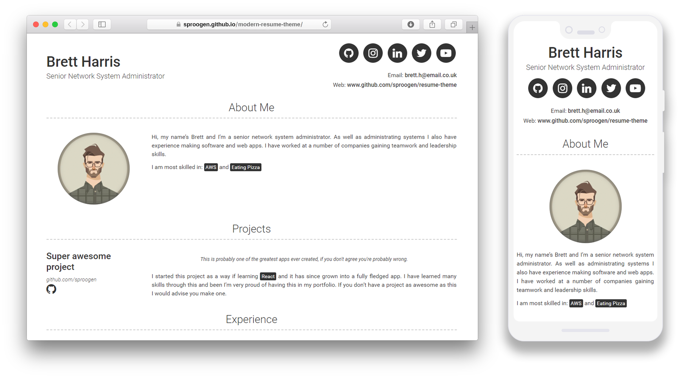

# modern-resume-theme [](https://badge.fury.io/rb/modern-resume-theme) 

*A modern simple static resume template and theme. Powered by Jekyll and GitHub pages.*  
*Host your own resume on GitHub for **free!***

[View Demo](https://sproogen.github.io/modern-resume-theme/)

----

## Announcements

 - **Nov 2020** - Content configuration version 2 released. Added a new more configurable way of adding data to the resume. Add as many content sections as you like in what ever order you want. Currently just *text* and *list* but future categories coming soon.
Full backwards compatibilty with version 1 remains and the documentation for version 1 can be found [here (Version 1 Readme)](https://github.com/sproogen/modern-resume-theme/blob/1.x/README.md).

 - **Dec 2019** - Now includes **Dark Mode**

----



Thank you for checking out my resume theme / template. If you have any feedback or suggestions for things I can add please let me know by by raising an [issue](https://github.com/sproogen/modern-resume-theme/issues/new/choose), I'm always happy to help.

I always enjoy seeing how people are using my creations and if you would like to say thanks feel free to [buy me a coffee (buymeacoffee.com/vJ6HfLu)](https://buymeacoff.ee/vJ6HfLu).

If you would like to see how I am using this then you can view my resume [here (jameswgrant.co.uk)](http://www.jameswgrant.co.uk/) and find the code [here (sproogen/jameswgrant)](https://github.com/sproogen/jameswgrant), hopefully this might help you.

You can view the project [roadmap here](https://github.com/sproogen/modern-resume-theme/projects/1).

----

## Installation & setup guide
This template is designed to be hosted using GitHub pages and so that's what these instructions will cover. If you plan on hosting it seperately then there might be some extra steps that we wont cover.

Before starting it might be useful to familiarise yourself with [Jekyll](https://jekyllrb.com/docs/home/), [Markdown](https://www.markdownguide.org/getting-started) and [GitHub pages](https://pages.github.com/).

### Step 1 - GitHub
Start by creating an account on [GitHub](https://github.com/join)

### Step 2 - Create Repository
Create a repository on GitHub to hold your files and host your resume. You can find out how to do that [here](https://pages.github.com/)

### Step 3 - Download Resume Template
Download and extract the following zip into the git repository you have just created. [resume-template.zip](https://github.com/sproogen/modern-resume-theme/archive/gh-pages.zip)

### Step 4 - Push it
Commit and push the resume template to github
```
$ git add --all
$ git commit -m "Initial resume setup"
$ git push -u origin master
```
### Step 5 - See it
You should now be able to see the demo resume template using this theme at `[your-username].github.io`

----

## Usage

So now you will be able to see the demo template at your github URL. You can can edit the yml files and replace the demo content with your own. Hopefully it will be fairly simple to work out where all the content goes, but here is a quick overview.

### `_config.yml`
This will contain all the of the main configuration for your resume such as your name, email, social media links and about me content. It also contains all the content for your resume.  
A full example of the _config.yml can be found [here](https://github.com/sproogen/modern-resume-theme/blob/master/_config.yml)

#### Content
The main content for you resume will all come under the content property in the `_config.yml` file. This can be quite complex and a good understanding on [YAML](https://docs.ansible.com/ansible/latest/reference_appendices/YAMLSyntax.html) will be helpful here.

Content will contain an array of sections, there are currently 2 types of layouts for content sections, text and list.

**text** is a basic layout that contains markdown content.  
**list** is a the standard layout that is used for things like *Education* and *Experience*.

Below is a the full list of content options.
```
content:
  - title: Section Name
    layout: list (options: list, text)
    content:
      - layout: left (options: left, right, top, top-right, top-middle)(default: left)
        title: Name of item (eg. Company or Project name)
        sub_title: Sub title (eg. Qualification or Job title)(optional)
        caption: Item caption (eg. Employment or course dates)(optional)
        link: Web link (eg. https://sproogen.github.io/modern-resume-theme)(optional)
        link_text: Text for link (optional: without this link will show URL as link text)
        additional_links: (optional)
          - title: Link name
            icon: Font Awesome brand icon name (eg. fab fa-twitter) (https://fontawesome.com/icons?d=gallery&s=brands&m=free)
            url: Link url (eg. https://google.com)
        quote: >
          Short overview or quote for the item
        description: | # this will include new lines to allow paragraphs
          Main content area for the list item.
  - title: Section Name
    layout: text (options: list, text)
    content: | # this will include new lines to allow paragraphs
      This is where you can write a little more about yourself. You could title this section **Interests** and include some of your other interests.

      Or you could title it **Skills** and write a bit more about things that make you more desirable, like *leadership* or *teamwork*
```

***Note:** The description or content areas (fields starting with `| #`) use markdown, this means that you have the ability to format the section in many different ways and add things such as images, code & syntax highlighting and tables. You can find a good [Markdown cheatsheet here](https://github.com/adam-p/markdown-here/wiki/Markdown-Cheatsheet)*

#### Additional links
If you would like to add more than the predefined social links in the config file, then you can use the `additional_links` field to add as many additional links with urls and font awesome icons as you wish.

#### Dark Mode
Dark mode is configured via `_config.yml`  
```
darkmode: true (options: true, false, never)
```
When dark mode is `true` the site will show the dark theme for everyone  
When dark mode is `false` the site will not show the dark theme, but it will still respect the users device preferences  
When dark mode is `never` the site will never be shown in the dark theme

#### Heading Anchors
You can link to section titles using a Markdown anchor link, e.g.: `[About me](#about-me)`. The link after the `#` is the slug version of the title.

### `assets/main.scss`
Add any css changes or additions you want to make here after the line `@import 'modern-resume-theme';`

----

## Running locally

Before you start make sure you have *Ruby* and the gems for *Jekyll* installed locally. You can find out how to do that [here](https://jekyllrb.com/docs/installation/).

1. Clone your resume repository locally *(if you haven't already)*
2. `cd [your-repository-name]`
3. `bundle install`
4. `bundle exec jekyll serve`
5. Open your browser to `http://localhost:4000`

Any changes you make will automatically build and you will be able to see these by refreshing your browser.

*Note: You will need to re-run `bundle exec jekyll serve` to see changes made in `_config.yml`.*

----

## Contributing

Bug reports and pull requests are welcome on GitHub at https://github.com/sproogen/modern-resume-theme. You can view our full guide to contributing [here](https://github.com/sproogen/modern-resume-theme/blob/master/CONTRIBUTING.md)
This project is intended to be a safe, welcoming space for collaboration, and contributors are expected to adhere to the [Contributor Covenant](http://contributor-covenant.org) code of conduct.

----

## Development

### Locally

Before you start make sure you have *Ruby* and the gems for *Jekyll* installed locally. You can find out how to do that [here](https://jekyllrb.com/docs/installation/).

*Note: You will need version `1.15.2` of bundler, as this is the only version that Heroku supports.*

1. Fork and or clone this repository locally
2. `cd modern-resume-theme`
3. `bundle install`
4. `bundle exec jekyll serve`
5. Open your browser to `http://localhost:4000`

Any changes you make will automatically build and you will be able to see these by refreshing your browser. To find out more about *Jekyll* take a look [here](https://jekyllrb.com/docs/usage/).

***Note:** You will need to re-run `bundle exec jekyll serve` to see changes made in `_config.yml`.*

### Docker

If you have docker installed you can simply run `docker-compose up` to launch the site in a container, it will then be hosted at `http://localhost:4000`

----

## License

The theme is available as open source under the terms of the [MIT License](https://opensource.org/licenses/MIT).
